# Решение задания

1. [Установка ОС](#part-1-установка-ос)  
2. [Создание пользователя](#part-2-создание-пользователя)  
3. [Настройка сети ОС](#part-3-настройка-сети-ос)   
4. [Обновление ОС](#part-4-обновление-ос)  
5. [Использование команды  sudo](#part-5-использование-команды-sudo)  
6. [Установка и настройка службы времени](#part-6-установка-и-настройка-службы-времени)  
7. [Установка и использование текстовых редакторов](#part-7-установка-и-использование-текстовых-редакторов)  
8. [Установка и базовая настройка сервиса SSHD](#part-8-установка-и-базовая-настройка-сервиса-sshd)   
9. [Установка и использование утилит top, htop](#part-9-установка-и-использование-утилит-top-htop)   
10. [Использование утилиты fdisk](#part-10-использование-утилиты-fdisk)   
11. [Использование утилиты df](#part-11-использование-утилиты-df)    
12. [Использование утилиты du](#part-12-использование-утилиты-du)    
13. [Установка и использование утилиты ncdu](#part-13-установка-и-использование-утилиты-ncdu)    
14. [Работа с системными журналами](#part-14-работа-с-системными-журналами)     
15. [Использование планировщика заданий CRON](#part-15-использование-планировщика-заданий-cron)    

## Part 1. Установка ОС

**== Задание ==**

##### Установить **Ubuntu 20.04 Server LTS** без графического интерфейса. (Используем программу для виртуализации - VirtualBox)

- Графический интерфейс должен отсутствовать.

- Узнайте версию Ubuntu, выполнив команду \
`cat /etc/issue.`
- Вставьте скриншот с выводом команды.

**== Решение ==**

- Была установленна программа VirtualBox

- С [официального сайта](http://releases.ubuntu.com/20.04/) был скачан образ для дальнейшей установки

- Была установлена **Ubuntu 20.04.2 Server LTS** без графического интерфейса.

    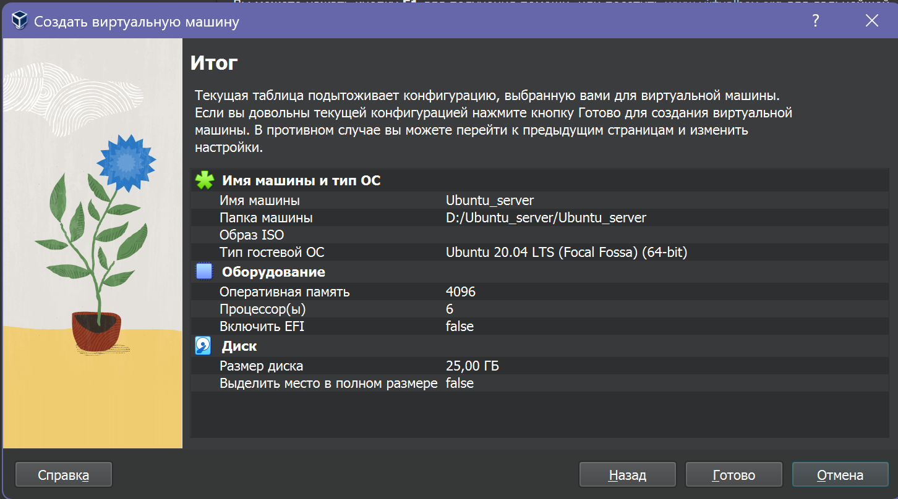

- Результат выполнения команды `cat /etc/issue`:

    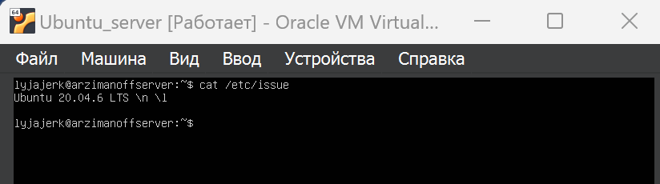

## Part 2. Создание пользователя

**== Задание ==**

##### Создать пользователя, отличного от пользователя, который создавался при установке. Пользователь должен быть добавлен в группу `adm`.

- Вставьте скриншот вызова команды для создания пользователя.
- Новый пользователь должен быть в выводе команды \
`cat /etc/passwd`
- Вставьте скриншот с выводом команды.

**== Решение ==**

- Создадим нового пользователя `newuser` с помощью команды:
    ```
    sudo adduser newuser
    ```

    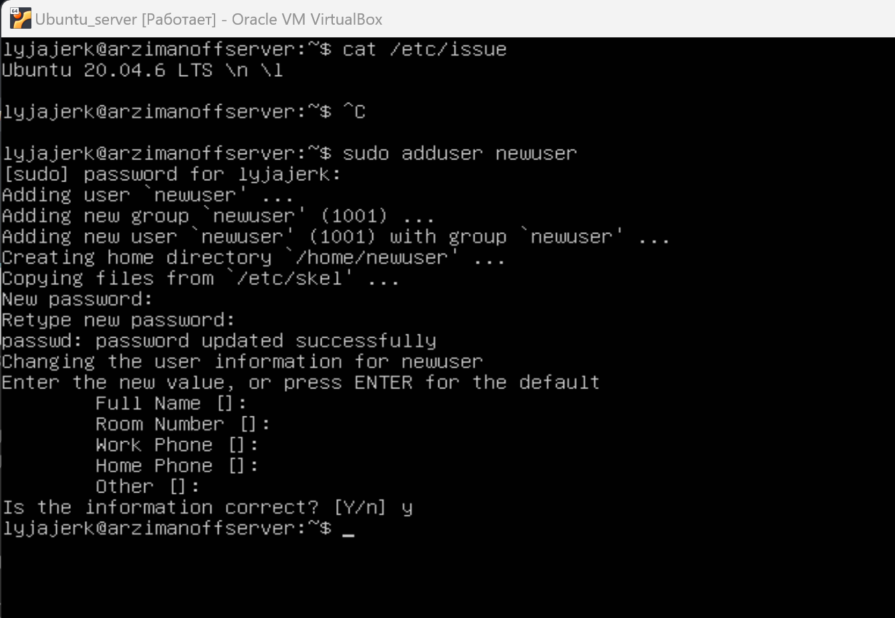

- Добавим нового пользователя `newuser` в группу `adm` с помощью команды:
    ```
    sudo usermod -a -G adm newuser
    ```

    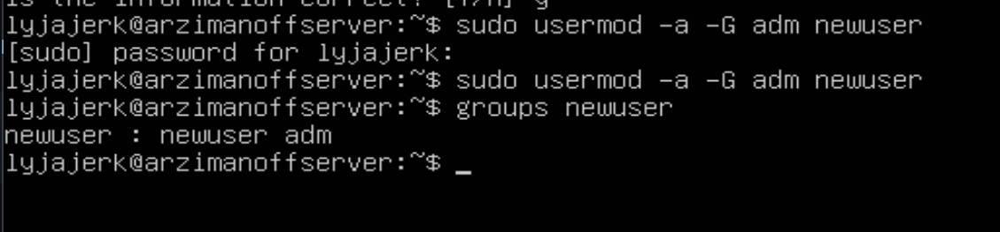

- Новый пользователь присутствует в выводе команды
`cat /etc/passwd`

    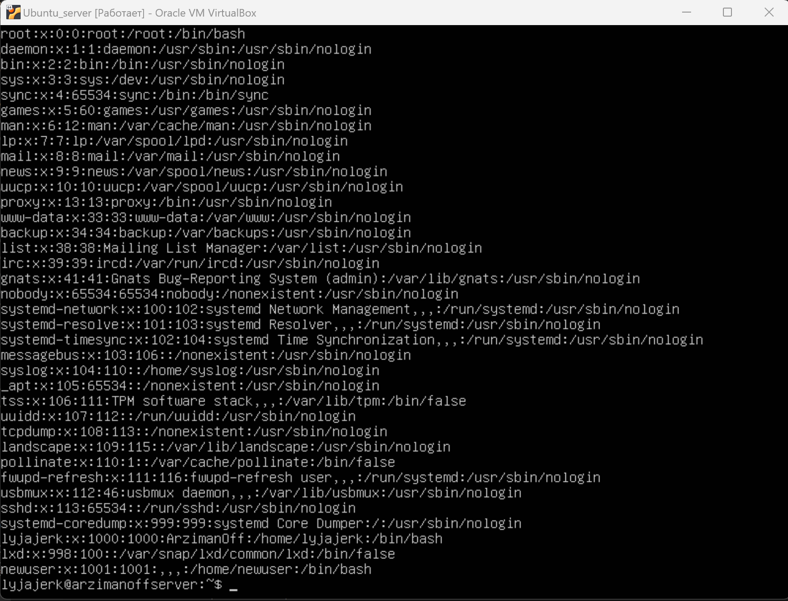


## Part 3. Настройка сети ОС

**== Задание ==**

##### Задать название машины вида user-1  
##### Установить временную зону, соответствующую вашему текущему местоположению.  
##### Вывести названия сетевых интерфейсов с помощью консольной команды.
- В отчёте дать объяснение наличию интерфейса lo.  
##### Используя консольную команду получить ip адрес устройства, на котором вы работаете, от DHCP сервера. 
- В отчёте дать расшифровку DHCP.  
##### Определить и вывести на экран внешний ip-адрес шлюза (ip) и внутренний IP-адрес шлюза, он же ip-адрес по умолчанию (gw). 
##### Задать статичные (заданные вручную, а не полученные от DHCP сервера) настройки ip, gw, dns (использовать публичный DNS серверы, например 1.1.1.1 или 8.8.8.8).  
##### Перезагрузить виртуальную машину. Убедиться, что статичные сетевые настройки (ip, gw, dns) соответствуют заданным в предыдущем пункте.  

- В отчёте опишите, что сделали для выполнения всех семи пунктов (можно как текстом, так и скриншотами).
- Успешно пропинговать удаленные хосты 1.1.1.1 и ya.ru и вставить в отчёт скрин с выводом команды. В выводе команды должна быть фраза "0% packet loss".

**== Решение ==**

- С помощью команды `hostname` выясним, что при установке ОС машине было задано задано название `arzimanoffserver`. 

    

- Зададим новое название машины: `user-1`; с помощью команды:
    ```
    sudo hostname user-1
    ```
- После выполнения этой команды проверим текущее название командой `hostname`

    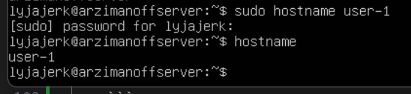

- Чтобы после `reboot` машины, выставленное ранее название не сбросилось, воспользуемся командой:
    ```
    sudo hostnamectl set-hostname user-1
    ```

    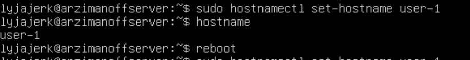

- После повторной перезагрузки, наименование машины не изменится.

---

- Чтобы узнать какая временная зона установлена на данный момент можно воспользоваться командой `date`. Данная временная зона не соответствует текущему местоположению:

    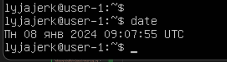

- Для изменения часового пояса на требуемый Europe/Moscow, используем команду:
    ```
    sudo timedatectl set-timezone Europe/Moscow
    ```

    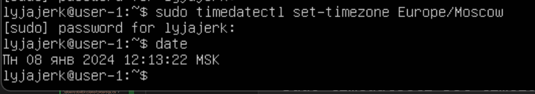

- Повторная проверка текущей временной зоны, выполненная с помощью команды `date`, показала актуальные значения.
---

- Вывести названия сетевых интерфейсов с помощью консольных команд:
    ```
    ip l
    ```
    ```
    ip address
    ```
    ```
    ls /sys/class/net
    ```

    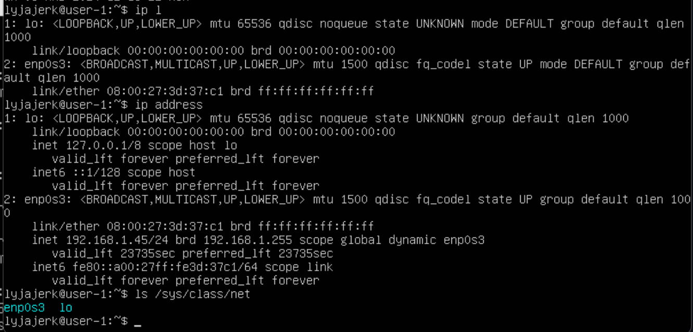

- >lo (loopback device) – виртуальный интерфейс, присутствующий по умолчанию в любом Linux. Он используется для отладки сетевых программ и запуска серверных приложений на локальной машине. С этим интерфейсом всегда связан адрес 127.0.0.1. У него есть dns-имя – localhost. Интерфейс lo является локальной петлёй. Она предназначена для обеспечения сетевого доступа к компьютеру.

---

- Чтобы узнать ip адрес машины, выданный ей DHCP сервером воспользуемся командой:
    ```
    cat /var/log/syslog | grep -i dhcp
    ```

    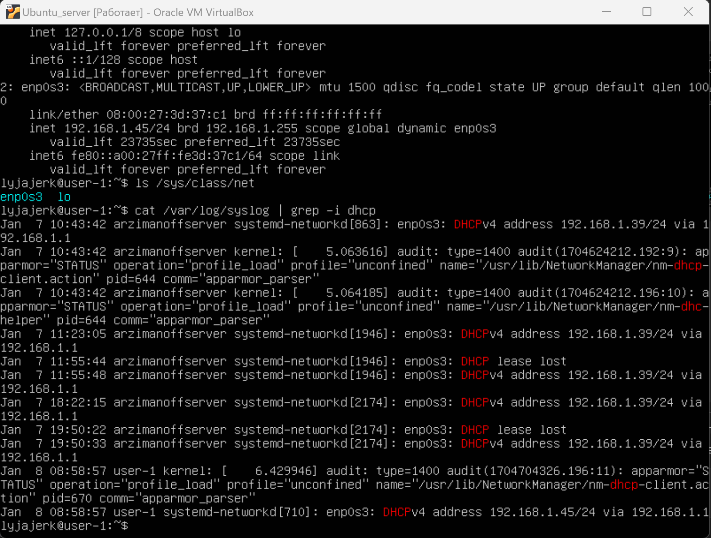
    
- На скриншоте видно, что DHCP выдал компьютеру ip адрес: 192.168.1.45/24

- Также ip адрес машины, выданный ей DHCP сервером, можно узнать с помощью команды: 
    ```
    ip r
    ```
    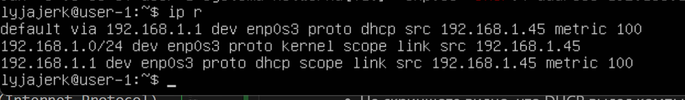

- >DHCP (Dynamic Host Configuration Protocol) - протокол динамической конфигурации хоста. Сетевой протокол, позволяющий устройствам автоматически получать IP-адрес и другие параметры, необходимые для работы в сети TCP/IP. Данный протокол работает по модели «клиент-сервер». Для автоматической конфигурации компьютер-клиент на этапе конфигурации сетевого устройства обращается к так называемому серверу DHCP и получает от него нужные параметры. IP-адрес (Internet Protocol) - способ адресации устройств по сети.

---
- Чтобы определить и вывести на экран внешний ip-адрес шлюза (ip) воспользуемся командой:
    ```
    curl ifconfig.co
    ```
    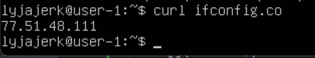


- Чтобы определить и вывести на экран внутренний IP-адрес шлюза, он же ip-адрес по умолчанию (gw), можно воспользоваться командами:
    ```
    ip route
    ```
    ```
    route -n
    ```
    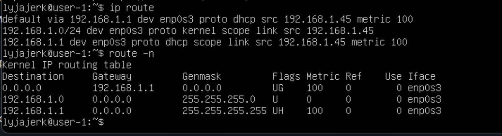
    
- Как видно из скриншотов, внешний IP-адрес шлюза: 77.51.48.111; а внутренний: 192.168.1.1.

---

- Зададим статичные (заданные вручную, а не полученные от DHCP сервера) настройки ip, gw, dns (используя публичные DNS серверы, например 1.1.1.1 или 8.8.8.8). DHCP автоматически присваивает устройству IP, поэтому сначала необходимо отключить облачную инициализацию. Нужно открыть файл конфигурации `subiquity-disable-cloudinit-networking.cfg` в каталоге `/etc/cloud/cloud.cfg.d/` с помощью команды:
```
sudo vim /etc/cloud/cloud.cfg.d/subiquity-disable-cloudinit-networking.cfg
```

- Необходимо, чтобы было: `config: disabled`

    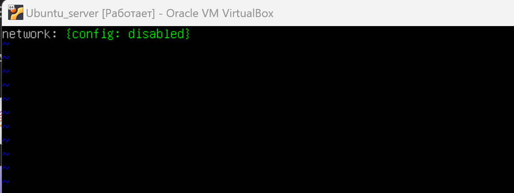

- Откроем файл конфигурации `netplan` в текстовом редакторе `vim` с помощью команды:
    ```
    sudo vim /etc/netplan/00-installer-config.yaml
    ```

    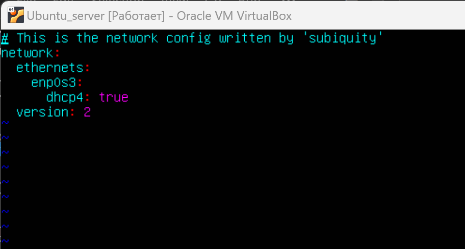

- Зададим статические настройки: изменим параметр dhcp4 на значение `false`, в `addresses` укажем статический IP-адрес: `192.168.1.45/24`, и в `gateway4` зададим внутренний IP-адрес `192.168.1.1`. В параметре `addresses` раздела `nameservers` укажем публичные серверы.

    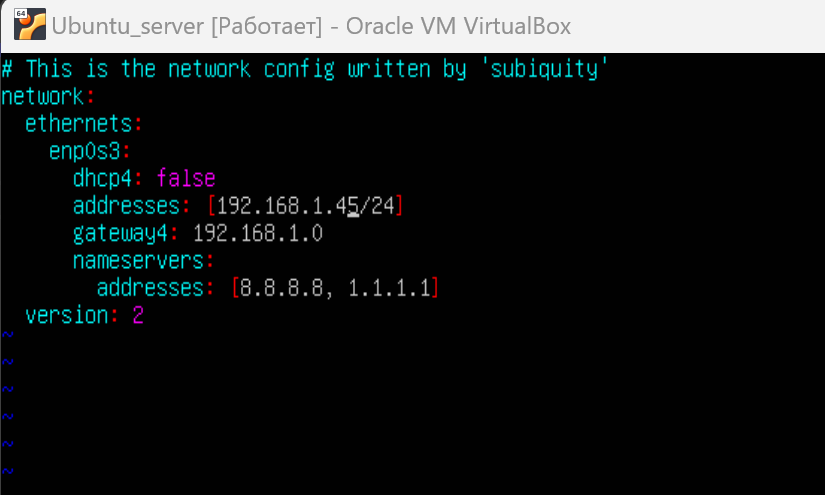

- Для применения изменений используем команду:
    ```
    sudo netplan apply
    ```

- Далее перезагрузим виртуальную машину командой `reboot` и проверяем сохранились ли выставленные вручную настройки (проверяем сохранились ли изменения в файле конфигурации). Для этого воспользуемся командой:
    ```
    cat /etc/netplan/00-installer-config.yaml
    ```

    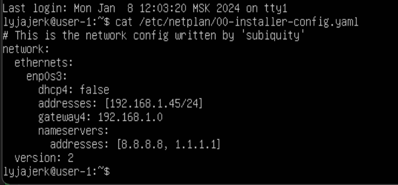

- Также, для проверки статического IP-адреса можно использовать команды:
    ```
    ip route show
    ```
    ```
    ifconfig
    ```

    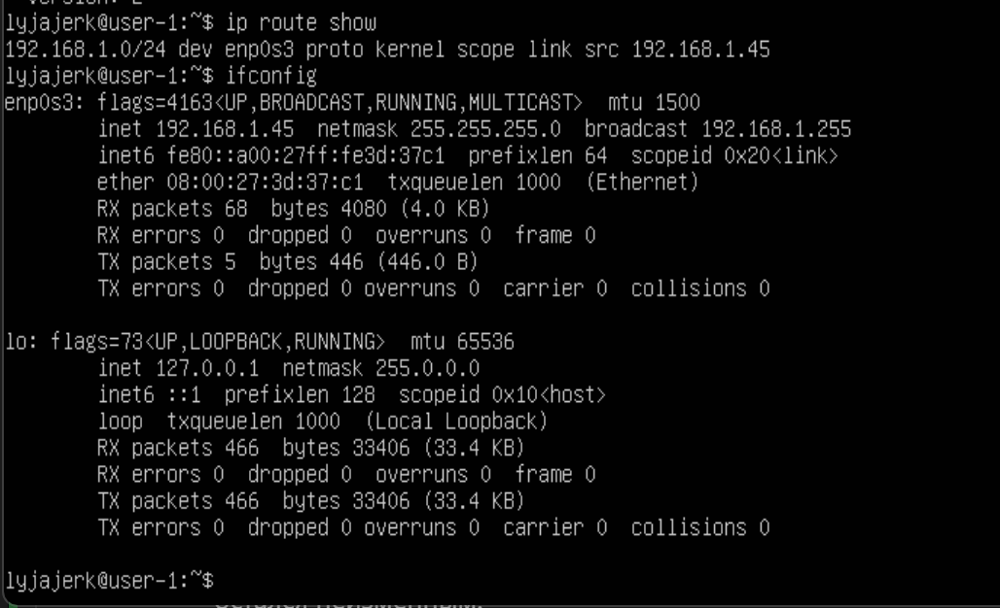

- На скриншотах видно, что выставленный вручную статический IP-адрес `192.168.1.45` после перезагрузки остался неизменным.

---

- Пропингуем удаленные хосты 1.1.1.1 и ya.ru с помощью команд:
    ```
    ping 1.1.1.1 -c 3
    ```
    ```
    ping ya.ru -c 3
    ```
    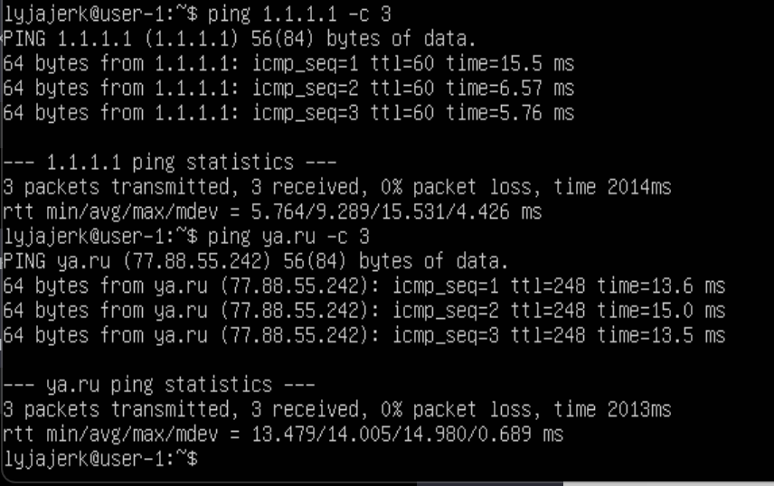

- На скриншоте видно, что выводе команды присутвствует фраза `0% packet loss`, это свидетельствует о том, что компьютер получил ответ от всех отправленных на указанные сервера пакетов данных.

- >Ping — утилита для проверки целостности и качества соединений в сетях. Утилита отправляет запросы указанному узлу сети и фиксирует поступающие ответы. Время между отправкой запроса и получением ответа позволяет определять двусторонние задержки по маршруту и частоту потери пакетов, то есть косвенно определять загруженность на каналах передачи данных и промежуточных устройствах.

## Part 4. Обновление ОС

**== Задание ==**

##### Обновить системные пакеты до последней на момент выполнения задания версии.  

- После обновления системных пакетов, если ввести команду обновления повторно, должно появится сообщение, что обновления отсутствуют.
- Вставить скриншот с этим сообщением в отчёт.

**== Решение ==**

- Для обновления индекса пакетов или списка пакетов, воспользуемся командой:
    ```
    sudo apt update
    ```
- Обновим системные пакеты до последней, на момент выполнения задания, версии, используя команду:
    ```
    sudo apt full-upgrade
    ```
    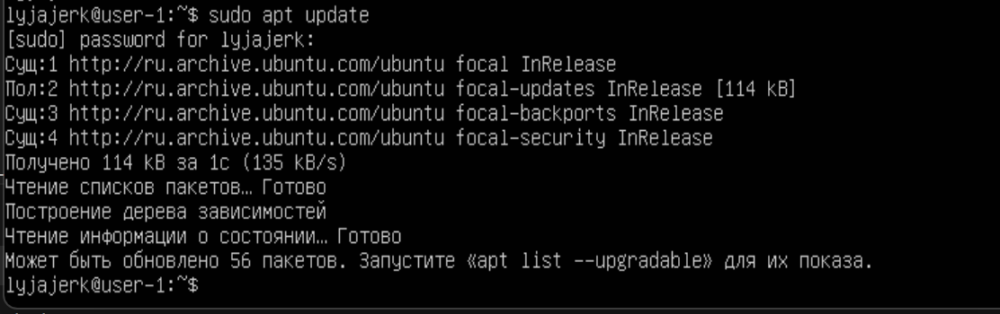

- После обновления системных пакетов видим, что при повторном введении двух последних команд получены сообщения об отсутствии новых обновлений
    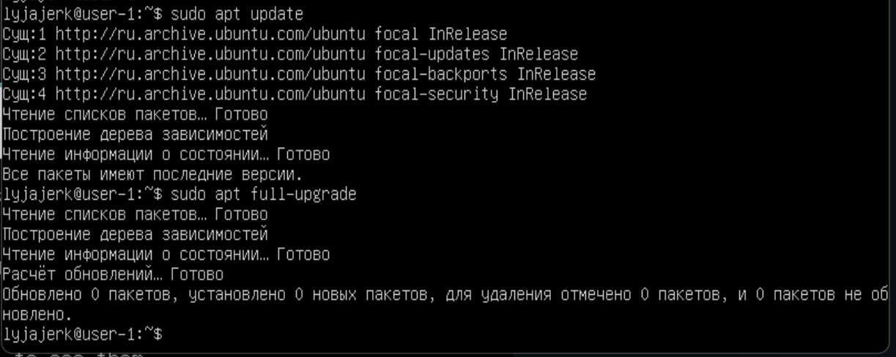

## Part 5. Использование команды **sudo**

**== Задание ==**

##### Разрешить пользователю, созданному в [Part 2](#part-2-создание-пользователя), выполнять команду sudo.

- В отчёте объяснить *истинное* назначение команды sudo (про то, что это слово - "волшебное", писать не стоит).  
- Поменять hostname ОС от имени пользователя, созданного в пункте [Part 2](#part-2-создание-пользователя) (используя sudo).
- Вставить скрин с изменённым hostname в отчёт.

**== Решение ==**

- Разрешим пользователю, созданному в [Part 2](#part-2-создание-пользователя), выполнять команду sudo. Для этого необходимо добавить пользователя `newuser` в группу `sudo`. Воспользуемся командой:
    ```
    sudo usermod -a -G sudo newuser
    ```
- Проверим к каким группам принадлежит пользователь `newuser` с помощью команды:
    ```
    groups newuser
    ```

    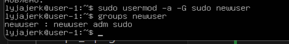

- На скриншоте видно, что пользователь был добавлен в группу `sudo`. Это дает ему возможность выполнять команду `sudo`.

- >Sudo (Substitute user and do - подменить пользователя и выполнить) – это утилита для операционных систем семейства Linux, позволяющая пользователю запускать программы с привилегиями другой учётной записи, как правило, суперпользователя.

- Поменяем hostname ОС от имени пользователя, созданного в пункте [Part 2](#part-2-создание-пользователя) (используя sudo). Для этого необходимо сменить текущего пользователя `lyjajerk` на ранее созданного `newuser` с помощью команды:
    ```
    su newuser
    ```

    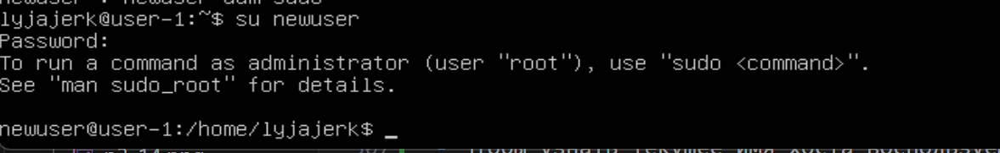

- Чтобы узнать текущее имя хоста воспользуемся командой:
    ```
    hostnamectl
    ```
- Изменим имя хоста с `user-1` на `user-2` с помощью команды:
    ```
    sudo hostnamectl set-hostname user-2
    ```
- Проверим изменения командой:
    ```
    hostname
    ```

    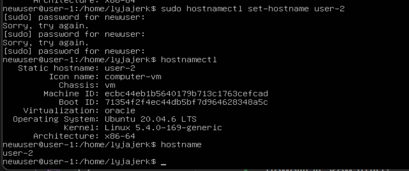

- Выполним перезагрузку машины командой `reboot` и проверим сохранность изменений:

    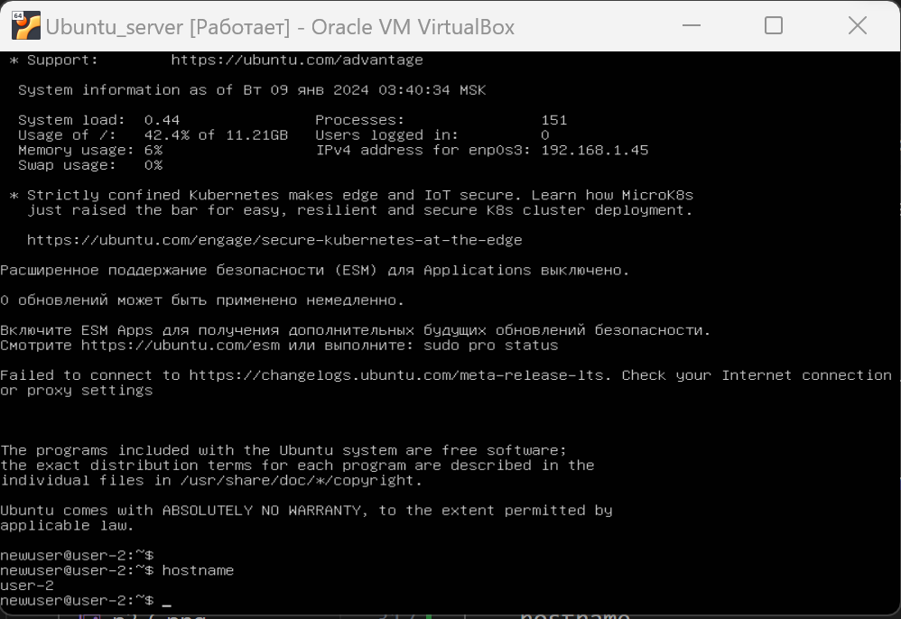


## Part 6. Установка и настройка службы времени

**== Задание ==**

##### Настроить службу автоматической синхронизации времени.  

- Вывести время, часового пояса, в котором вы сейчас находитесь.
- Вывод следующей команды должен содержать `NTPSynchronized=yes`: \
  `timedatectl show`
- Вставить скрины с корректным временем и выводом команды в отчёт.

**== Решение ==**

- С помощью команды `date` выведем текущее время часового пояса, в котором мы находимся.

- Для вывода настроек часового пояса, используем команду:
    ```
    timedatectl show
    ```

    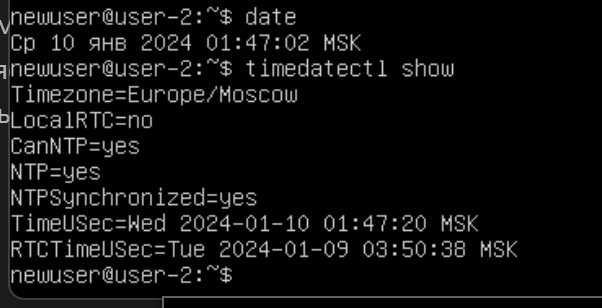

- >На скриншоте видно, что вывод команды `timedatectl show` содержит `NTPSynchronized=yes`, это соответствует требованию задания. Данная запись свидетельствует о том, что протокол NTP (сетевой протокол времени) активен. NTP - это протокол, отвечающий за синхронизацию времени компьютера со стандартными эталонными часами через интернет с помощью иерархии серверов NTP.
